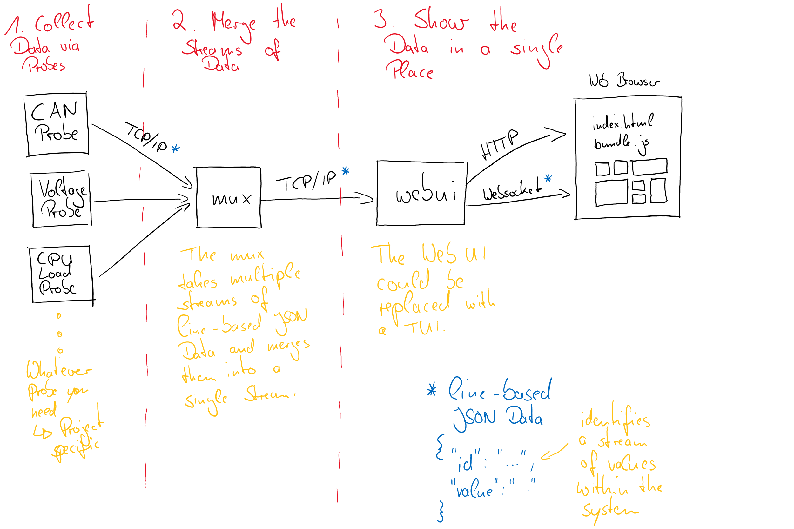

# Veza - A Dashboard for your Lab

Veza is an browser based application that displays any live data in a
well-organized way. It aims to be a freely configurable dashboard with various
widgets that can be used to display and control information from various data
sources and sinks. The driving use case is the integration into a lab-like
setup.

## Key Principles

It shall be a tool that can be easily and quickly adapted to a constantly
changing setup. It is supposed to be used exclusively to display an as-is state
and is executed in a trustworthy environment. This results in the following
guiding principles:

* Bring-up, maintenance and switching configs shall be as low-friction as
  possible (e.g. by means of easy editable config files, no graphical editor)
* There's no persistence layer (database or similar)
* Data won’t be logged (except that the view layer may display the last x
  values)
* It is time-agnostic, i.e. it shows the current state as fast as it can
  without any sync or sorting of data in a timely manner etc.
* There's  no user management (login, roles, rights etc…)

## Architectural Overview

## Why the Name?

The Name Veza is a [Zulu word](https://isizulu.net/?-veza) meaning "bring into
view" or simply "show". Therefore it describes exactly what this project is
about: Bring your whole lab setup into view.
